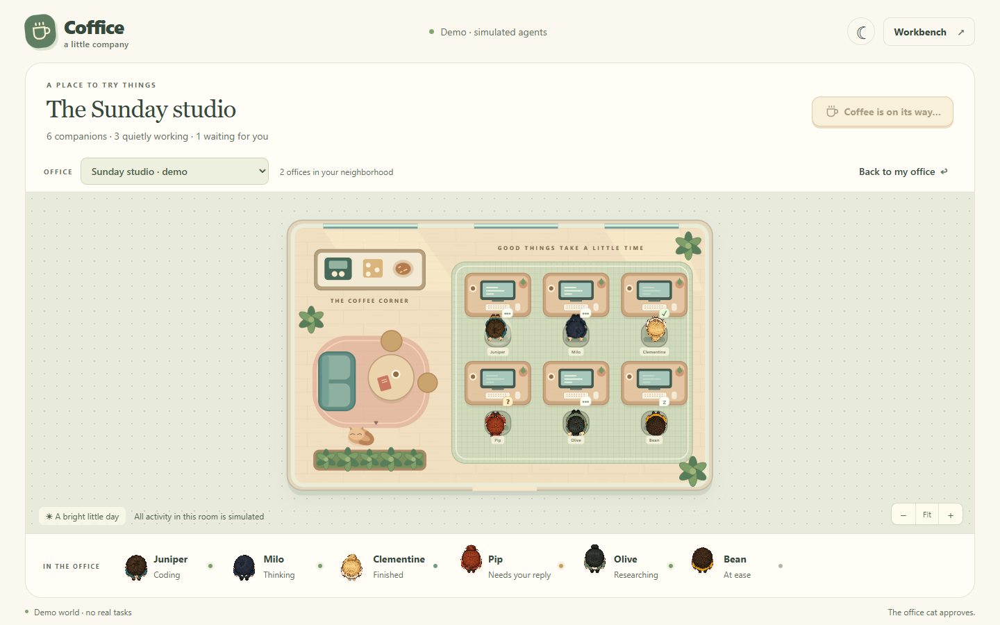

# Coffice

A little office for your Codex agents. Leave it open beside your work and watch
the room come to life: agents settle at their desks, think, work, and wait for
you. Pick an occupant, take a coffee break, or switch the lights for a quieter
evening.

Coffice is a playful desktop companion. It reads local task metadata and gives
it a place to live. The animation is for fun; the status labels tell you what
Coffice actually knows.



## Open the office

Download the Windows x64 application from
[Releases](https://github.com/Unthropic/Coffice/releases), then double-click
the executable. Coffice starts its own runtime. You do not need Node.js, a
terminal, or a separate web server to use the download.

This is **1.0.0-rc.2**, an experimental desktop and source-distributed release
candidate. The Windows build is unsigned, so Windows may ask whether you trust
the downloaded application. macOS and Linux desktop packages are not included.

For live occupants, use the same Windows account as your local Codex desktop
installation. Coffice does not restart or take over Codex. If no compatible
local data is available, you can still explore the explicitly labelled demo.

## Make yourself at home

- Choose a project to visit its office and select an agent to see its task and
  last observed state.
- Use the small office interactions to play with the scene. They affect the
  room's presentation, never the agent's actual work.
- Try the demo office to explore a populated scene. Its occupants are simulated
  and kept separate from live tasks.
- Open **Workbench** when you want the earlier planning, Attention, review,
  and separately confirmed Codex actions. These tools are optional.

Status is a local observation, not a promise of instant synchronization. Older
evidence and unavailable sources are labelled. Coffice never invents progress
from an animation or an agent's apparent mood.

## Your work stays yours

Coffice reads visible top-level task metadata, including titles, explicit
project assignments, timestamps, and structural lifecycle events. It does not
import Codex conversations, prompts, responses, or credentials, and it never
writes to Codex-owned files or databases.

The companion's playful interactions do not send instructions to Codex. The
optional Workbench keeps its own plans and review records in ordinary local
files and a backup, protected by your operating-system account. Its supported
Codex actions require explicit confirmation. See [Privacy](docs/privacy.md).

## Build from source

Development requires Node.js 24+, npm, and Git. Optional Workbench actions also
require a compatible local Codex CLI with App Server support.

```powershell
npm.cmd ci
npm.cmd run dev
```

The development app runs at `http://127.0.0.1:3003`. To build the Windows app:

```powershell
npm.cmd run desktop:build
```

The packaged application is written to `desktop-release/`. Close any Coffice
development server before launching it: both use the same local port. See
[Operating Coffice](docs/operations.md) for configuration and troubleshooting.

## Project notes

- [Architecture](docs/architecture.md)
- [Privacy and local data](docs/privacy.md)
- [Install, back up, upgrade, and remove](docs/operations.md)
- [Release history](CHANGELOG.md)
- [Contributing](CONTRIBUTING.md) and [Security](SECURITY.md)
- [Production artwork](docs/pixel-assets.md)

Source code and documentation use the [Apache License 2.0](LICENSE). Artwork in
`public/assets/` has a separate [artwork license](ASSET-LICENSE.md). Dependencies
retain their own licenses.
